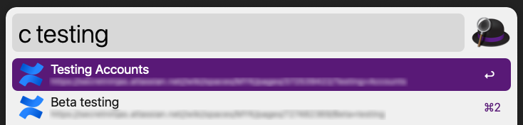

# Alfred Confluence Search workflow



An [Alfred workflow](https://www.alfredapp.com/) to easily search through [Atlassian Confluence](https://www.atlassian.com/software/confluence) written in [NodeJS](https://nodejs.dev/) using [Alfy](https://github.com/sindresorhus/alfy)

Inspired by [Alfred Confluence written in Python2](https://github.com/skleinei/alfred-confluence) by [skleinei](https://github.com/skleinei)

## Automatic notification of updates
The workflow informs you when a new version is available


## Install

```sh
npm install --global alfred-confluence-search
```

*Requires [Node.js](https://nodejs.org) 14+ and the Alfred [Powerpack](https://www.alfredapp.com/powerpack/).*

## Workflow Environment Variables


1. Click on the `[X]` (red arrow) to open the Workflow Environment Variables window
2. Set the value of the 3 Workflow Environment Variables:
   - `BASE_URL`
        When your Confluence url is https://myawesomecompany.atlassian.net/wiki/spaces/MYK/pages/1323642387/Bootstrapping the `BASE_URL` is `https://myawesomecompany.atlassian.net`
   - `USERNAME`
        username to login into your Atlassian account
   - `API_TOKEN` your Atlassian API token from https://id.atlassian.com/manage-profile/security/api-tokens

## Usage

In Alfred type `c` and your query followed by <kbd>Enter</kbd>
